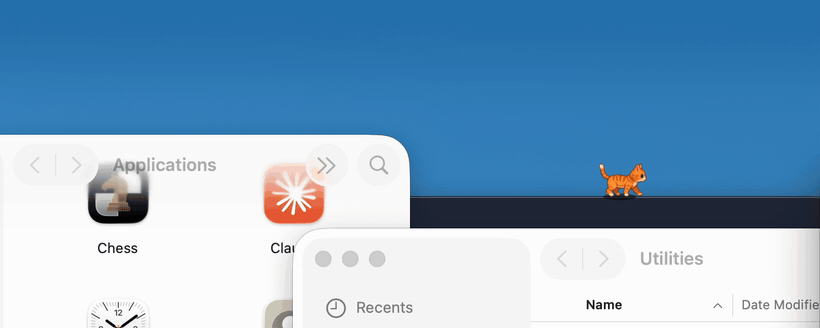
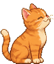

<h1 align="center">Ogi</h1>

<p align="center">
  <b>A cat that lives in your notch and treats your windows as terrain.</b>
</p>

<p align="center">
  
</p>

<p align="center">
  <sub>Real screen recording, five shots: he steps down onto a window, leaps the gaps between
  them, climbs a window face to get back up, gets petted, and joins a call.</sub>
</p>

<p align="center">
  <a href="LICENSE.md"></a>
  
  <a href="https://github.com/hbofz/Ogi/releases/latest"></a>
  
</p>

---

Ogi walks along the top edges of your open windows, jumps between them, and falls when you close
the one he was standing on. He goes **behind** windows that are in front of him, which nothing
else on any platform does.

He asks for no permissions, has no settings, no account, and no network. He is just there.

## Install

Download the latest `Ogi.zip` from [**Releases**](https://github.com/hbofz/Ogi/releases/latest),
unzip, and drag `Ogi.app` to `/Applications`.

The first launch is blocked by macOS, because Ogi is signed but not notarised (that needs a paid
Apple Developer account, and there isn't one yet). To allow it:

**System Settings → Privacy & Security →** scroll down **→ Open Anyway**

Or, in a terminal: `xattr -c /Applications/Ogi.app`

> Being suspicious of an app that asks you to do that is the right instinct. The source is all
> here, and `./run.sh` builds the identical bundle from it.

**To quit, click the cat in your menu bar.** There is no Dock icon by design.

## What he does

**He treats your desktop as terrain.** Window edges are ledges. He steps across small gaps,
jumps ones he can reach, stops at a drop to lean over and look down before committing, and
climbs the face of a window to get back up. Close the window under him and he falls.

**He notices your machine.** Plug in the charger and he is comically electrocuted. Connect
AirPods and he grooves. Run the battery low and he powers down flat. When your microphone goes
live he puts on a headset; when your camera goes live he sits at a tiny laptop and works.

**The notch is his house.** He walks out of it at launch, walks *through* it to cross the menu
bar, hangs off its lower lip doing pull-ups, and sleeps inside it with only his tail showing.



**You can pet him.** Move your cursor across his body and he shuts his eyes, pushes his head up
into your hand, and **purrs through your trackpad** using haptic feedback. A purr you can
physically feel.

**He costs nothing.** 0.0% CPU when idle, measured. Once he settles, the display link stops
outright and he wakes once a second to check whether you are back. The battery cost of a desktop
pet is processor wakeups, not pixels.

## He cannot spy on you, by construction

**Ogi requests no permissions. Not one.** There is no prompt on first launch, because there is
nothing he needs to ask for.

He reads the *position and size* of your windows, never their titles and never their pixels.
Titles would need Screen Recording permission, so he does not read them. He feels your typing
*rhythm* through a system keystroke counter that reports a number and cannot report a key. He
can tell your microphone is live without listening to it.

This is a constraint, not a claim: **if a feature needs a permission, it does not ship.** Several
planned behaviours were cut for exactly that reason.

## Build from source

Requires macOS 14+ and a Swift 6 toolchain.

```sh
git clone https://github.com/hbofz/Ogi.git && cd Ogi
./run.sh
```

```sh
swift test          # 350 tests; the world model and physics are pure functions
./release.sh 1.0.0  # builds, tests, bundles and zips a release
```

Some of what was learned building this is written up in
[docs/macos-notes.md](docs/macos-notes.md) — most of it is either undocumented or widely
misremembered.

## Uninstall

Quit from the menu bar and delete the app. Ogi writes nothing outside itself, creates no
preferences, and installs no login item, agent, or helper.

## License

**[PolyForm Noncommercial 1.0.0](LICENSE.md) — source-available, not open source.**

Free for anything that is not commercial: personal use, study, hobby projects, and non-profit,
educational and government organisations are all covered explicitly. What you may not do is make
money from it. Commercial rights are retained.

"Source-available" is not a synonym for open source, and the distinction is deliberate rather
than sloppy. The licence is one page of plain English; read it rather than this summary.

## Contributing

**Bug reports are the most useful thing you can send**, and they need nothing from you but the
report. Code contributions need a copyright assignment first, and
[CONTRIBUTING.md](CONTRIBUTING.md) explains exactly why rather than leaving you to guess.
