# Every animation

All 32 of them, at the rate the app actually plays them. Generated by
`Tools/make-animation-gallery.py` straight from the shipped sprites, so it cannot
drift from what he really does.

## Moving

Everything that gets him from one place to another. Windows are terrain, and
their top edges are ledges.

| | Clip | Frames | Rate | When |
|---|---|---|---|---|
| 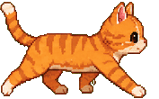 | `walk` | 6 | 10fps | Getting somewhere along a ledge. |
| 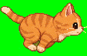 | `run` | 8 | 14fps | The same, in a hurry: a long way to go, and not feeling sluggish. |
| 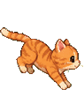 | `jump` | 6 | 12fps (holds its last frame) | The crouch and the launch. Also every airborne frame. |
| 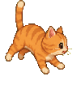 | `fall` | 6 | 12fps (holds its last frame) | The righting reflex. Plays whether he was dropped or his window vanished. |
| 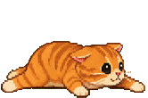 | `land` | 3 | 14fps (holds its last frame) | Touching down. Doubles as the pull-up when he mantles onto a ledge. |
| 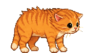 | `shake` | 4 | 12fps (holds its last frame) | Shaking it off after a landing hard enough to rattle him. |
| 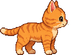 | `turn` | 4 | 12fps (holds its last frame) | Pivoting on the spot rather than flipping, which reads as a glitch. |
|  | `cling` | 4 | 4fps | Gripping a vertical window face, deciding whether to go up or slide down. |
|  | `climbUp` | 6 | 12fps | Going up one on purpose. The only route off the desktop. |

## Resting

Where he spends most of his life. The failure mode of all of these is animating
too much, so several move by two or three pixels and no more.

| | Clip | Frames | Rate | When |
|---|---|---|---|---|
| 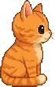 | `idle` | 4 | 2.5fps | Standing about. Breathing, and almost nothing else. |
| 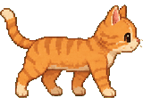 | `sitdown` | 5 | 8fps (holds its last frame) | Settling, when the room has been quiet for a while. |
|  | `curl` | 5 | 6fps (holds its last frame) | Curling up. Ends on the sleeping pose and holds it. |
| 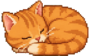 | `sleep` | 3 | 2.5fps | Asleep. The display link is stopped underneath this; he costs nothing. |
| 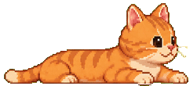 | `lounge` | 4 | 2.5fps | Sprawled flat, head up, watching the room. What a bare desktop gets. |
| 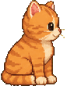 | `groom` | 6 | 8fps | Washing. The commonest thing he does out of boredom. |
| 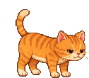 | `stretch` | 5 | 5fps (holds its last frame) | The wake-up bow and yawn. Every wake, unlock and plug-in. |

## Looking at things

Noticing is half of what makes something read as alive.

| | Clip | Frames | Rate | When |
|---|---|---|---|---|
| 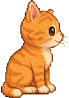 | `alert` | 3 | 1.2fps | Frozen and listening. Your microphone went live, or you are typing hard. |
| 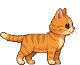 | `lookDown` | 4 | 6fps (holds its last frame) | Head over the lip of a drop, deciding whether to commit. |
| 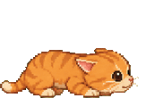 | `peek` | 4 | 5fps (holds its last frame) | Creeping out of the notch, low and cautious. Also how he waits in its doorway. |
|  | `peer` | 4 | 2.5fps | Head and paws over the top edge of the window that was hiding him. |

## The notch

His house. Nothing renders behind a hardware cutout, which is the whole
design constraint of these three and the reason none of them can be screenshotted.

| | Clip | Frames | Rate | When |
|---|---|---|---|---|
|  | `denSleep` | 4 | 2.5fps | Asleep inside the notch. All you can see is a tail below the bar line. |
| 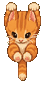 | `hang` | 6 | 6fps | Hanging off the notch's lower lip by his front paws, doing reps. |
|  | `peerDown` | 4 | 4fps | Lying in the notch, head over its lower lip, watching you. |

## Your machine

Performances, each triggered by something real happening to your Mac.

| | Clip | Frames | Rate | When |
|---|---|---|---|---|
| 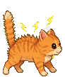 | `zap` | 5 | 10fps (holds its last frame) | Comically electrocuted. The charger just went in. |
|  | `vibe` | 6 | 4fps | Grooving. An audio device connected — your AirPods are in. |
| 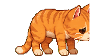 | `droop` | 6 | 5fps (holds its last frame) | Powering down flat. The battery just crossed properly low. |
| 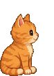 | `curious` | 6 | 6fps (holds its last frame) | A head-tilt at a question mark. Something arrived on the cable. |
|  | `callTalk` | 6 | 6fps | On a call with a boom mic: your microphone is live and your camera is not. |
|  | `callWork` | 4 | 8fps | At a tiny laptop, typing: your camera is live and your microphone is not. |
|  | `callFull` | 4 | 8fps | Both, which is what a real call looks like. |

## Touching him

The two things you can do to him directly.

| | Clip | Frames | Rate | When |
|---|---|---|---|---|
| 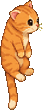 | `held` | 4 | 3fps | Dangling by the scruff, limp, legs tucked. This is what actually happens to cats. |
|  | `stroked` | 5 | 4fps | Eyes shut, head pushed up into your hand, and the trackpad purring. |

---

Drawn as green-screen sheets, one animation to a row, and cut into transparent
frames by `Tools/extract-sprites.swift`. Every clip is normalised on the width of
his eye so that sheets generated weeks apart still render the same cat — except the
handful whose eyes cannot be measured, which carry their own height instead.
